# Architecture Documentation

This document provides a comprehensive overview of the Ask AI For You application architecture, data flow, and component interactions.

## Table of Contents

1. [System Architecture](#system-architecture)
2. [Component Architecture](#component-architecture)
3. [Data Flow](#data-flow)
4. [State Management](#state-management)
5. [Technology Stack](#technology-stack)
6. [File Structure](#file-structure)

## System Architecture

### High-Level System Diagram

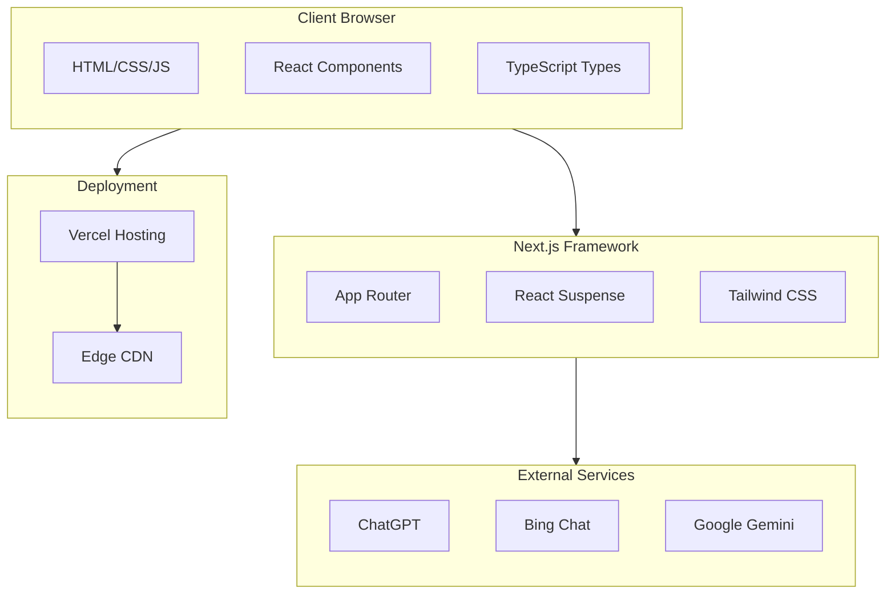

### Application Layers

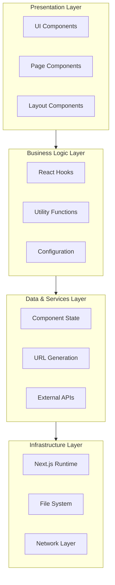

## Component Architecture

### Component Hierarchy

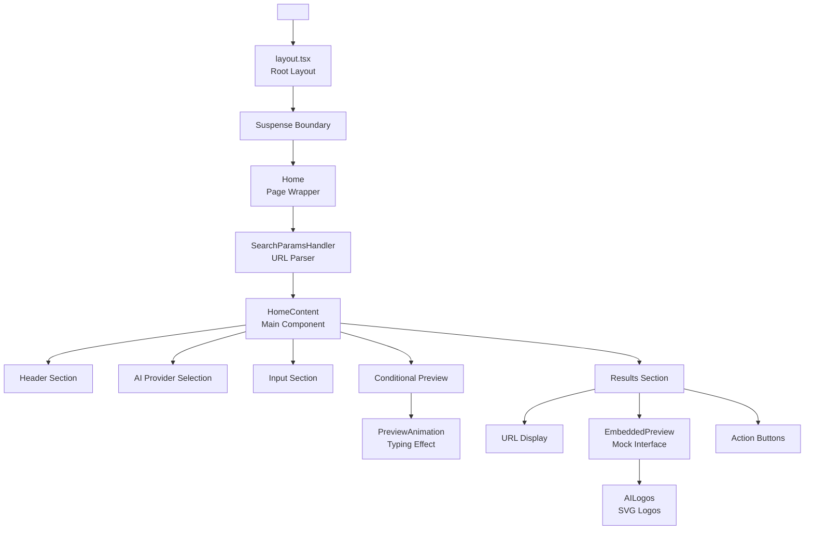

### Component Dependencies

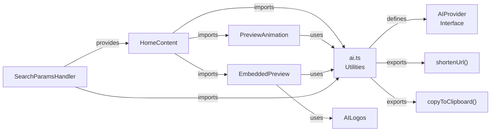

## Data Flow

### URL Generation Flow

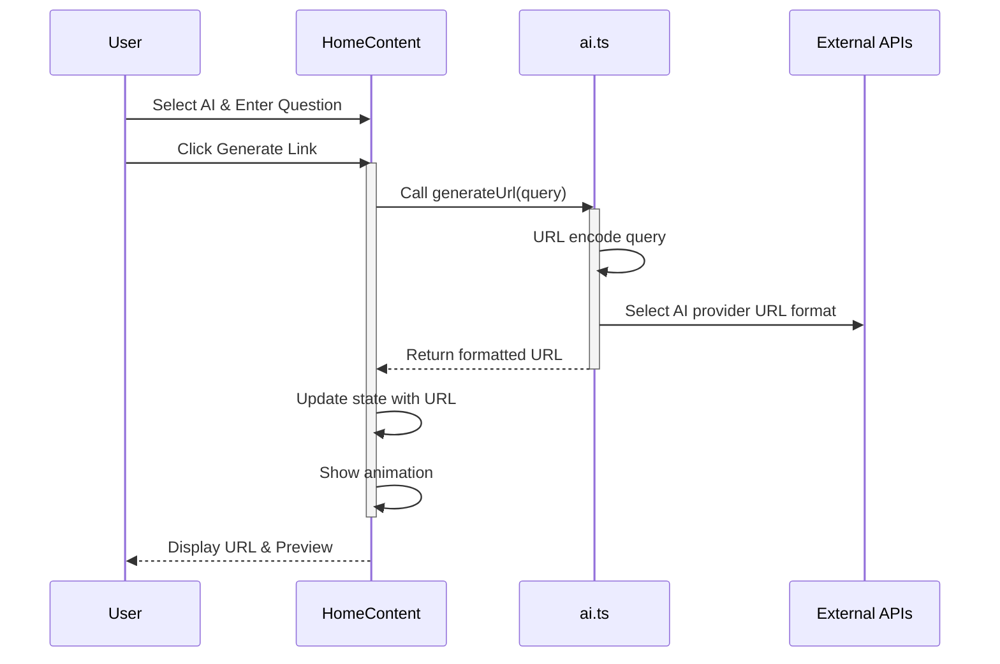

### Animation Sequence

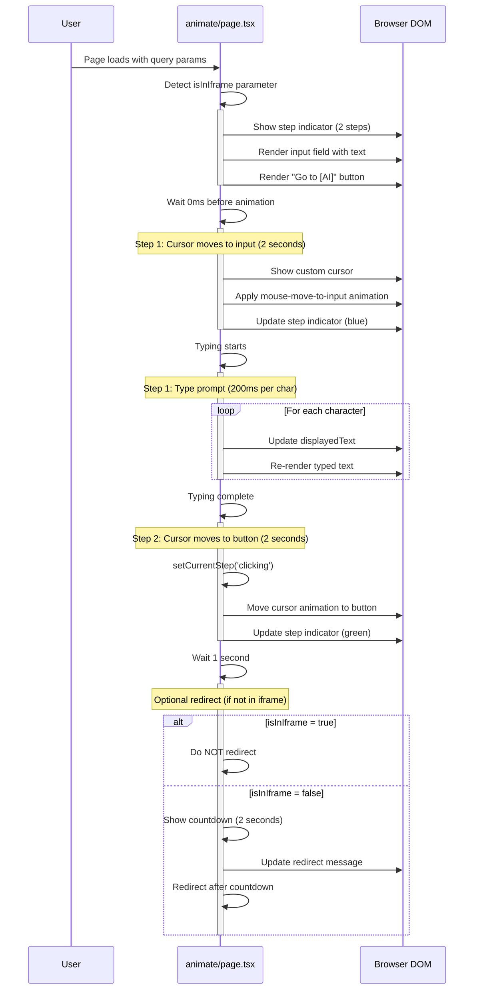

### State Management Flow

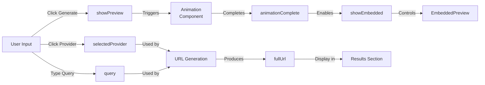

## State Management

### HomeContent State Variables

```typescript
// UI State
const [selectedProvider, setSelectedProvider] = useState<AIProvider>();
const [query, setQuery] = useState<string>();
const [showPreview, setShowPreview] = useState<boolean>();
const [animationComplete, setAnimationComplete] = useState<boolean>();
const [showEmbedded, setShowEmbedded] = useState<boolean>();

// Data State
const [fullUrl, setFullUrl] = useState<string>();

// UI Feedback State
const [isCopying, setIsCopying] = useState<boolean>();
const [copiedMessage, setCopiedMessage] = useState<string>();
```

### State Transitions

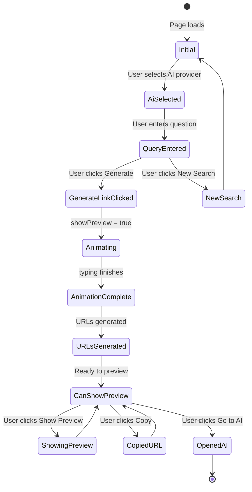

## Technology Stack

### Frontend Framework

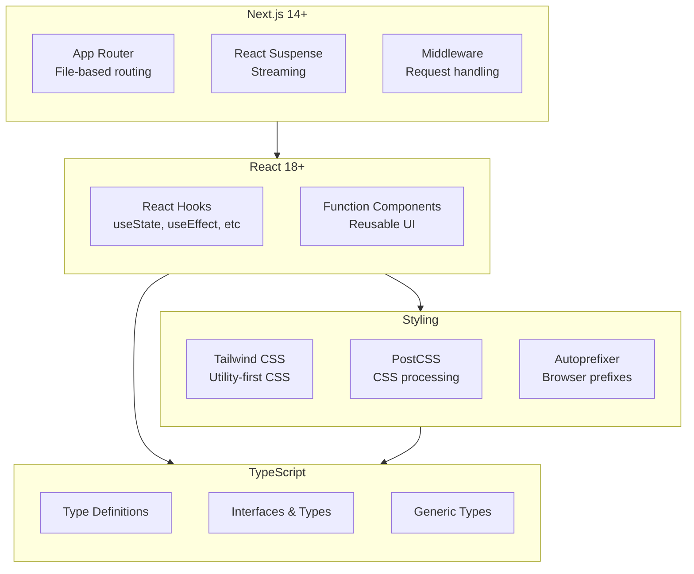

### Build & Deployment

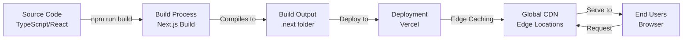

## File Structure

### Directory Tree

```
letmeaskaiforyou/
│
├── src/                           # Source code directory
│   ├── app/                       # Next.js App Router
│   │   ├── layout.tsx            # Root layout component
│   │   ├── page.tsx              # Home page
│   │   └── globals.css           # Global styles
│   │
│   ├── components/               # Reusable React components
│   │   ├── HomeContent.tsx       # Main content component with state
│   │   ├── PreviewAnimation.tsx  # Typing animation component
│   │   ├── EmbeddedPreview.tsx   # Mock AI interface preview
│   │   ├── SearchParamsHandler.tsx # URL query parameter handler
│   │   └── AILogos.tsx           # SVG logo components
│   │
│   ├── utils/                    # Utility functions
│   │   └── ai.ts                 # AI provider config & utilities
│   │
│   └── styles/                   # Stylesheets
│       └── globals.css           # Global styles (duplicated intentionally)
│
├── public/                        # Static assets
│
├── Configuration Files
│   ├── package.json              # Dependencies & scripts
│   ├── tsconfig.json             # TypeScript configuration
│   ├── tailwind.config.ts        # Tailwind CSS configuration
│   ├── postcss.config.js         # PostCSS configuration
│   ├── next.config.js            # Next.js configuration
│   ├── .eslintrc.json            # ESLint configuration
│   ├── .gitignore                # Git ignore rules
│   └── vercel.json               # Vercel deployment config
│
├── Documentation
│   ├── README.md                 # Main documentation
│   ├── CONTRIBUTING.md           # Contribution guidelines
│   ├── TROUBLESHOOTING.md        # Troubleshooting guide
│   ├── ARCHITECTURE.md           # This file
│   └── LICENSE                   # MIT License
│
└── Build Output (not in git)
    └── .next/                    # Next.js build artifacts
```

### Source Code Organization

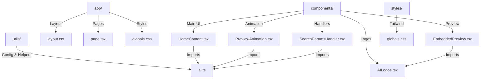

## Data Models

### AIProvider Interface

```typescript
interface AIProvider {
  // Unique identifier
  id: 'chatgpt' | 'copilot' | 'gemini';
  
  // Display name
  name: string;
  
  // Unicode icon/emoji (legacy, kept for compatibility)
  icon: string;
  
  // Path to logo PNG file
  logo: string;
  
  // Tailwind gradient class for buttons
  color: string;
  
  // Header background gradient
  headerBg: string;
  
  // Chat bubble color for preview
  bubbleColor: string;
  
  // Function to generate URL with query
  generateUrl: (query: string) => string;
}
```

### Component Props

```typescript
// PreviewAnimation
interface PreviewAnimationProps {
  query: string;
  provider: AIProvider;
  isActive: boolean;
  onAnimationComplete: () => void;
}

// EmbeddedPreview
interface EmbeddedPreviewProps {
  url: string;
  provider: AIProvider;
  isVisible: boolean;
}

// SearchParamsHandler
interface SearchParamsContextProps {
  children: (props: {
    queryParam: string | null;
    selectedProvider: AIProvider;
    setSelectedProvider: (provider: AIProvider) => void;
    autoStart: boolean;
  }) => React.ReactNode;
}
```

## Performance Considerations

### Optimization Strategies

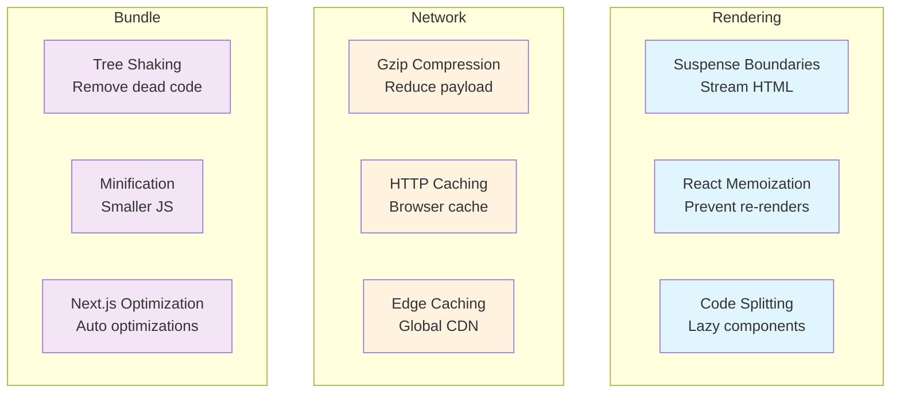

## Security Considerations

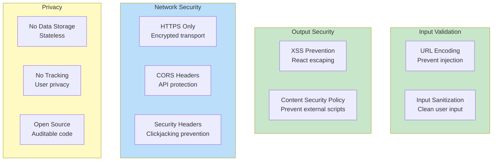

---

For more information, see:
- [README.md](README.md) - User guide and features
- [CONTRIBUTING.md](CONTRIBUTING.md) - Development guidelines
- [TROUBLESHOOTING.md](TROUBLESHOOTING.md) - Common issues

Last updated: November 10, 2025
