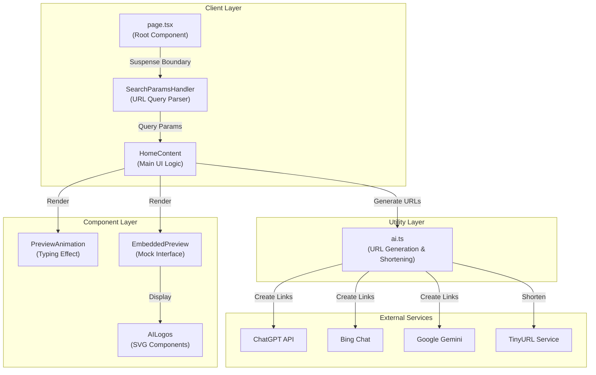
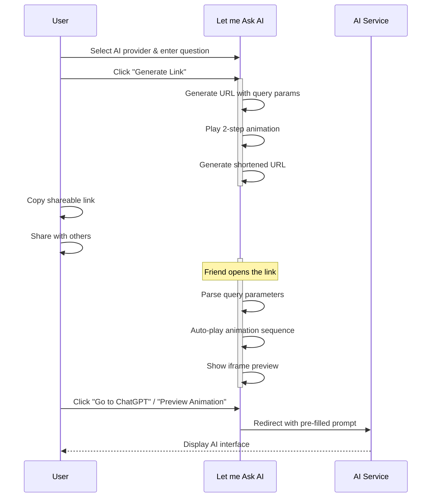
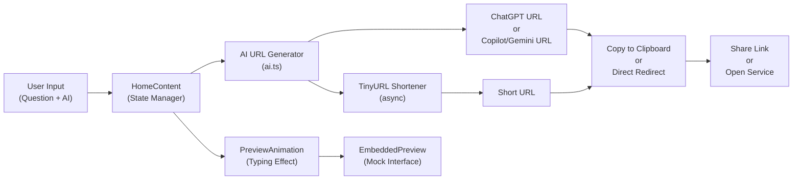

# Ask AI For You 🤖

> Generate shareable links to ask **ChatGPT**, **Microsoft Copilot**, or **Google Gemini** anything with pre-filled prompts and animated demonstrations.

[](https://nextjs.org/)
[](https://www.typescriptlang.org/)
[](https://tailwindcss.com/)
[](LICENSE)

## Overview

Ask AI For You is an open-source web application that simplifies the process of sharing AI queries. Instead of describing what to ask an AI assistant, just share a link—when someone opens it, they'll see an animated demonstration of your question being typed out, followed by a beautiful preview of what the AI interface looks like with your pre-filled prompt.

Perfect for:
- **Content creators** demonstrating AI capabilities
- **Educators** showing how to use AI tools
- **Teams** collaborating on AI-generated content
- **Anyone** who wants to share AI queries in a fun, visual way

## ✨ Features

### 🔗 Multi-AI Support
- **ChatGPT** - Auto-generates direct URLs (no copy-paste needed!)
- **Microsoft Copilot** - Generate and share queryable links
- **Google Gemini** - Beautiful Gemini-themed interface

### 🎬 Realistic Animations
- **Typing animation** - Character-by-character typing simulation (200ms per character)
- **Cursor movement** - Mouse cursor animates from input field to button
- **Step indicators** - Two-step progress tracker: "Type your prompt" → "Go to the AI"
- **Smooth transitions** - Polished fade-in and slide-in effects

### 🔗 Shareable Links
- Copy full URLs with one click
- Shareable links that auto-play animations
- Direct links to AI services with pre-filled prompts

### 👀 Interactive Previews
- iframe preview showing exactly what users will see
- Provider-specific color themes
- Realistic message bubbles
- Preview-in-page animations without redirect

### 📱 Responsive Design
- Works seamlessly on desktop and mobile
- Touch-friendly interface
- Optimized for all screen sizes

### 🚀 Modern Tech Stack
- **Next.js 14** - Server-side rendering and static optimization
- **React 18** - Component-based UI
- **TypeScript** - Type-safe code
- **Tailwind CSS** - Utility-first styling
- **Vercel Ready** - One-click deployment

## 📊 Architecture



## 🗂️ Project Structure

```
letmeaskaiforyou/
├── src/
│   ├── app/
│   │   ├── layout.tsx           # Root layout with Tailwind styles
│   │   ├── page.tsx             # Main page with Suspense boundary
│   │   └── globals.css          # Global styles and animations
│   ├── components/
│   │   ├── HomeContent.tsx      # Main UI component with state management
│   │   ├── PreviewAnimation.tsx # Typing animation component
│   │   ├── EmbeddedPreview.tsx  # Mock AI interface preview
│   │   ├── SearchParamsHandler.tsx # URL query parameter handler
│   │   └── AILogos.tsx          # SVG logo components
│   ├── utils/
│   │   └── ai.ts                # AI provider config & utilities
│   └── styles/
│       └── globals.css          # Tailwind directives & animations
├── public/
├── package.json
├── tsconfig.json
├── tailwind.config.ts
├── postcss.config.js
├── next.config.js
└── vercel.json
```

## 🚀 Quick Start

### Prerequisites
- **Node.js** 18.x or higher
- **npm** or **yarn** or **pnpm**

### Installation

```bash
# Clone the repository
git clone https://github.com/elicortez/letmeaskaiforyou.git
cd letmeaskaiforyou

# Install dependencies
npm install

# Start development server
npm run dev
```

Open [http://localhost:3000](http://localhost:3000) in your browser.

### Development Commands

```bash
# Start dev server with hot reload
npm run dev

# Build for production
npm run build

# Start production server
npm start

# Run linting
npm run lint

# Type check
npm run type-check
```

## 💡 How It Works



## 📝 Usage Examples

### Basic Usage

1. **Select an AI Provider**
   - Choose from ChatGPT, Microsoft Copilot, or Google Gemini
   - Each has its own color theme and branding

2. **Type Your Question**
   - Enter any question or prompt you want to share
   - Example: "How do I write a Python web scraper?"

3. **Generate Link**
   - Click "Generate Link"
   - Watch the smooth typing animation
   - See the animated preview of the AI interface

4. **Copy & Share**
   - Copy the full URL or the shortened version
   - Generate a shareable link with animation
   - Share on social media, docs, or messaging apps

### Advanced: Query Parameters

Share links directly with query parameters:

```
https://letmeaskaiforyou.com/?q=your+question&ai=chatgpt
```

Parameters:
- `q` - Your question (URL encoded)
- `ai` - AI provider (`chatgpt`, `copilot`, `gemini`)
- `iframe` - Set to `true` to prevent automatic redirect (for previews)

When someone opens this link:
- ✅ The animation plays automatically
- ✅ The correct AI provider is pre-selected
- ✅ They can click to go directly to the AI service
- ✅ Step indicators show the typing and clicking progress

### 🎨 Customization

### Typing Speed

Edit the typing animation speed in `src/app/animate/page.tsx`:

```typescript
const typingSpeed = 200; // milliseconds per character
// 200ms = current speed (slower, easier to read)
// 120ms = faster typing
// 50ms = very fast
```

### Cursor Movement Animation

Customize cursor paths in `src/styles/globals.css`:

```css
@keyframes mouse-move-to-input {
  0% { left: 10%; top: 5%; }
  100% { left: 50%; top: 55%; }
}

@keyframes mouse-move-to-button {
  0% { left: 50%; top: 55%; }
  100% { left: 50%; top: 88%; }
}
```

### Step Indicators

The two steps displayed at the top can be customized in `src/app/animate/page.tsx`:
- Step 1: "Type your prompt"
- Step 2: "Go to [AI Name]"

## 🔄 Data Flow



## 🌐 Deployment

### Deploy to Vercel (Recommended)

1. Push your code to GitHub
2. Go to [vercel.com](https://vercel.com)
3. Click "New Project"
4. Import your GitHub repository
5. Vercel auto-detects Next.js configuration
6. Click "Deploy"

**Environment Variables**: Currently none required!

### Deploy Elsewhere

This is a standard Next.js app, so it works on:
- **Netlify** - Direct Next.js support
- **Railway** - Built-in Next.js deployment
- **Docker** - Full Docker support available
- **Self-hosted** - Standard Node.js server

## 📚 API Documentation

### `AI_PROVIDERS` Object

```typescript
interface AIProvider {
  id: 'chatgpt' | 'copilot' | 'gemini';
  name: string;
  icon: string;
  color: string;                    // Tailwind gradient class
  headerBg: string;                 // Header background color
  bubbleColor: string;              // Chat bubble color
  generateUrl: (query: string) => string;
}
```

### `copyToClipboard(text: string): Promise<boolean>`

Copies text to user's clipboard.

```typescript
import { copyToClipboard } from '@/utils/ai';

const success = await copyToClipboard(url);
// Returns: true if successful
```

### `generateUrl(query: string): string`

Generates URL for a specific AI provider.

```typescript
const provider = AI_PROVIDERS.chatgpt;
const url = provider.generateUrl('How do I learn Python?');
// Returns: "https://chatgpt.com/?q=How+do+I+learn+Python%3F"
```

## 🐛 Troubleshooting

See [TROUBLESHOOTING.md](./TROUBLESHOOTING.md) for common issues and solutions.

### Common Issues

**Q: Animation is too fast/slow**
- Edit `src/components/PreviewAnimation.tsx`, line 23
- Change `typingSpeed = 120` to your preferred milliseconds

**Q: Preview doesn't show**
- Make sure to click "Show Preview" button after animation completes
- Works for all three AI providers (they all show mock interfaces)

**Q: URL not working**
- Ensure your question doesn't contain special characters that break URLs
- Use the URL encoding that's built into the app

## 🤝 Contributing

We welcome contributions! See [CONTRIBUTING.md](./CONTRIBUTING.md) for guidelines.

### Quick Contribution Steps

1. Fork the repository
2. Create a feature branch (`git checkout -b feature/amazing-feature`)
3. Commit changes (`git commit -m 'Add amazing feature'`)
4. Push to branch (`git push origin feature/amazing-feature`)
5. Open a Pull Request

## 📋 Roadmap

- [ ] Additional AI providers (Claude, Perplexity, etc.)
- [ ] Browser history for generated links
- [ ] Share directly to social media
- [ ] Dark/Light theme toggle
- [ ] API endpoint for programmatic link generation
- [ ] Browser extension for quick link generation
- [ ] Multi-language support
- [ ] Customizable animation speed in UI
- [ ] Analytics dashboard to track link usage
- [ ] Custom URL slugs/aliases

## 📄 License

This project is open source and available under the **MIT License** - see [LICENSE](LICENSE) file for details.

## 🙏 Acknowledgments

- Built with [Next.js](https://nextjs.org/)
- Styled with [Tailwind CSS](https://tailwindcss.com/)
- Deployed with [Vercel](https://vercel.com/)
- URL shortening by [TinyURL](https://tinyurl.com/)

## 📞 Support & Contact

- **Issues** - Report bugs on [GitHub Issues](https://github.com/elicortez/letmeaskaiforyou/issues)
- **Discussions** - Join our [GitHub Discussions](https://github.com/elicortez/letmeaskaiforyou/discussions)

## 🌟 Star History

If you find this project useful, please consider giving it a star! ⭐

---

Made with ❤️ by [Eli Cortez](https://github.com/elicortez)

